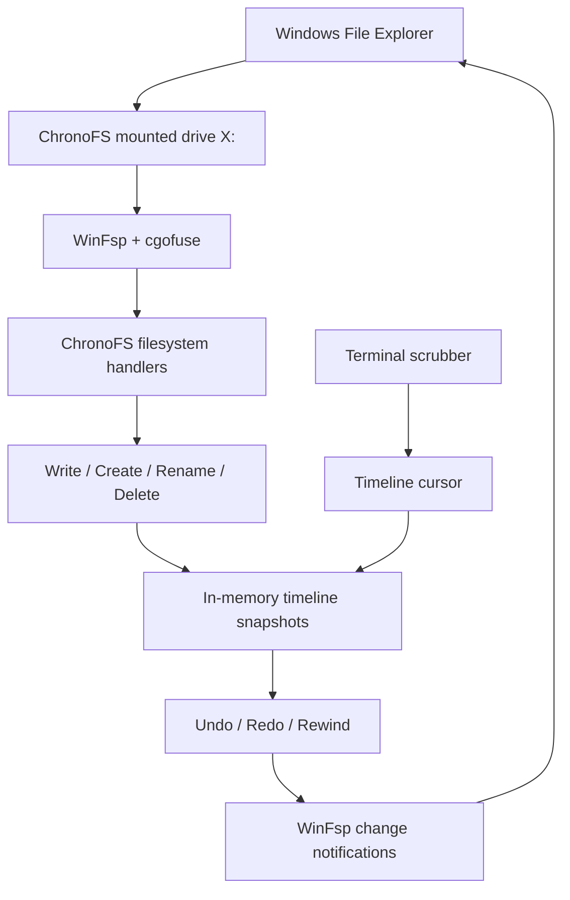

# ⏱ ChronoFS

### The file system where deletion is just another moment in time.

You know that feeling when you run a destructive command in the wrong folder and your stomach drops?

ChronoFS is built for that moment.

It is a Windows user-space filesystem that records changes in memory as they happen. Delete a file, rename a folder, overwrite code-then open the live scrubber and move backward through time. The mounted drive reconstructs itself directly in Windows File Explorer.

No Git commit required. No backup restore flow. No panic.

> Delete the project. Scrub backward. Watch it come back.

---

## What it does

ChronoFS mounts as a normal Windows drive using WinFsp.

Inside that drive, you can:

- Create and edit files normally.
- Create and remove folders.
- Rename files.
- Delete files or entire folder trees.
- Move backward through filesystem history with `undo`.
- Move forward again with `redo`.
- Open a full-screen terminal scrubber.
- Use Left/Right Arrow keys to move across the timeline.
- Watch files and directories appear or disappear live in Windows File Explorer.

Everything is tracked with high-resolution timestamps in an in-memory timeline.

---

## The demo

1. Mount ChronoFS as `X:`.
2. Open `X:\` in File Explorer.
3. See a small production-style project: source code, assets, config, and documentation.
4. Delete everything:

```powershell
Remove-Item X:\* -Recurse -Force
```
5. Explorer goes empty.
6. In the ChronoFS terminal, type:

```powershell
scrub
```
7. Press ←/A
8. The deleted project reconstructs itself in Explorer.

That is the whole idea:

> Delete → Scrub backward → Restore

## Why this exists

Most recovery tools start after something has already gone wrong.
ChronoFS makes recovery part of the filesystem experience itself. Instead of asking, “Do I have a backup?”, you ask, “Which moment do I want to return to?”
This is especially useful for:
- Accidental rm -rf / destructive cleanup commands.
- Broken refactors.
- Temporary experiments that went too far.
- Demo environments.
- Learning environments.
- Any workflow where fast, visual recovery matters.

## How it works



```text
Windows File Explorer
        │
        ▼
WinFsp mounted drive
        │
        ▼
ChronoFS FUSE handlers
        │
        ├── Create / write / truncate
        ├── Rename
        ├── Delete files
        └── Create / delete folders
        │
        ▼
In-memory timeline snapshots
        │
        ▼
Timeline cursor ↔ Explorer notifications
```

ChronoFS uses:

- Go for the filesystem and timeline engine.
- WinFsp to mount the project as a native Windows drive.
- gofuse as the Go-to-WinFsp filesystem bridge.
- In-memory snapshots to preserve each filesystem state.
- Windows change notifications so Explorer updates automatically when time moves.

## Controls

Run ChronoFS:

`go run .\cmd\chronofs mount X:`

Then use these commands in the same terminal:

| Command | What it does |
|---|---|
| `undo` | Moves one snapshot into the past. |
| `redo` | Moves one snapshot into the future. |
| `rewind 10` | Rewinds to the filesystem state from roughly 10 seconds ago. |
| `timeline` | Prints the recorded event history with timestamps. |
| `scrub` | Opens the interactive timeline scrubber. |
| `help` | Shows available commands. |

### Inside the scrubber

| Key | What it does |
|---|---|
| `←` or `A` | Move backward through time. |
| `→` or `D` | Move forward through time. |
| `Q` | Exit the scrubber. |

## Getting started

### Requirements
- Windows
- Go
- WinFsp
- The WinFsp Developer files option selected during installation

## Install dependencies

`go env -w CGO_ENABLED=0`

`go mod download`

### Run tests

```
go test .\...
```
### Mount the filesystem

```
go run .\cmd\chronofs mount X:
```
Keep that terminal running, then open:

`X:\`

Press Ctrl+C in the mount terminal when you want to unmount the drive.

## Current prototype scope

ChronoFS is a hackathon prototype and intentionally keeps history in memory.
That means:
- Timeline history exists only while ChronoFS is mounted.
- Unmounting clears the current timeline.
- It is designed for a safe demo drive, not real production data yet.
- The current implementation focuses on a compelling local Windows experience.
The next version would add persistent history, memory limits, optional disk-backed snapshots, richer metadata, and multi-drive support.


## Project structure

~~~text
cmd/chronofs/        CLI and interactive scrubber
internal/engine/     Timeline snapshots, cursors, undo, and redo
internal/fs/         WinFsp filesystem handlers and Explorer notifications
internal/timeline/   Timeline package foundation
~~~

## Built for Hack The Limit

ChronoFS was built to explore one simple question:

> What if deleting a file was not the end of its story?

Then `test` that the project still builds:

~~~powershell
go test ./...
~~~
